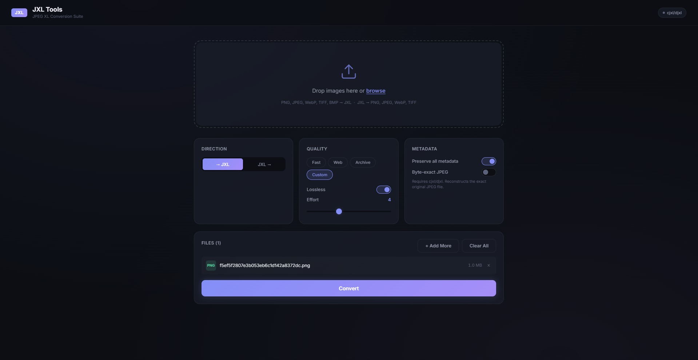

# JXL Tools



A JPEG XL conversion suite with a web UI and a command-line interface.  
Convert images to and from [JPEG XL](https://jpeg.org/jpegxl/) with quality tuning, metadata preservation, and batch processing.

## Features

- **Bi-directional conversion** — PNG, JPEG, WebP, TIFF, BMP → JXL and JXL → PNG, JPEG, WebP, TIFF
- **Quality controls** — lossless/lossy toggle, quality slider (1–100), effort level (1–9), Butteraugli distance
- **Quality presets** — *Fast*, *Web*, *Archive*, or fully custom settings
- **Metadata preservation** — EXIF data and ICC color profiles carried through conversion by default
- **Batch processing** — convert entire folders recursively with parallel workers, mirrored directory structure
- **Byte-exact JPEG reconstruction** — lossless JPEG↔JXL round-trip via bundled `cjxl`/`djxl`
- **Smart palette handling** — palette PNGs are routed through `cjxl`'s native Palette transform; falls back to WebP lossless or keeps the original if the output would be larger
- **Web UI** — drag files or folders into a polished batch UI with live progress, session logs, fallback visibility, summary cards, list/detail result views, and zip download
- **CLI** — scriptable command-line interface with rich progress bars and formatted output

---

## Installation

### Requirements

- **Python 3.12+**
- **[uv](https://docs.astral.sh/uv/)** (recommended) or pip

### Setup

```bash
# Clone the repository
git clone <repo-url>
cd jxl-tools

# Install with uv
uv sync

# Or with pip
pip install -e .
```

### Bundled libjxl tools

`cjxl` and `djxl` from [libjxl](https://github.com/libjxl/libjxl) are bundled for Windows (x64) and Linux (x86_64). Byte-exact JPEG reconstruction works out of the box — no separate install needed.

If you have your own `cjxl`/`djxl` on `PATH`, those take priority over the bundled versions.

> **macOS**: Not bundled yet. Install via `brew install jpeg-xl` or build from source. The tool falls back to Pillow-only mode gracefully.

---

## Quick Start

### Web UI

```bash
jxl-tools serve
```

Opens a browser at `http://127.0.0.1:8787`. Drop images onto the page, adjust settings, and click **Convert**.

### CLI — Single File

```bash
# Convert a PNG to JXL (default: quality 85, effort 7)
jxl-tools convert photo.png

# Convert with specific quality
jxl-tools convert photo.png -q 90

# Lossless conversion
jxl-tools convert photo.png --lossless

# Convert JXL back to PNG
jxl-tools convert photo.jxl

# Convert JXL to JPEG
jxl-tools convert photo.jxl --format jpeg
```

### CLI — Batch

```bash
# Convert all images in a folder to JXL
jxl-tools convert ./photos/

# Output to a specific directory
jxl-tools convert ./photos/ -o ./photos_jxl/

# Limit to 4 worker threads (default: all CPU cores)
jxl-tools convert ./photos/ -w 4

# Flatten output (don't mirror subdirectory structure)
jxl-tools convert ./photos/ -o ./output/ --flat
```

### CLI — File Info

```bash
# Show format, dimensions, EXIF, and ICC info
jxl-tools info photo.jxl
```

---

## Web UI Guide

### 1. Upload Images

- **Drag and drop** files or folders onto the drop zone, or click **browse** to select files
- Multiple files are supported — they'll be batch-converted together
- Supported input formats: PNG, JPEG, WebP, TIFF, BMP, JXL

### 2. Configure Settings

Once files are added, a settings panel appears with three sections:

#### Direction

| Button | What it does |
|:-------|:-------------|
| **→ JXL** | Converts your images *to* JPEG XL |
| **JXL →** | Converts JXL files *back* to a conventional format |

When **JXL →** is selected, an **Output Format** dropdown appears (PNG, JPEG, WebP, or TIFF).

> The direction is auto-detected from your files — if most are `.jxl`, it defaults to **JXL →**.

#### Quality

| Control | Range | Description |
|:--------|:------|:------------|
| **Presets** | Fast / Web / Archive / Custom | One-click quality profiles (see table below) |
| **Lossless** | On/Off | When on, produces a mathematically lossless output. Quality slider is hidden. |
| **Quality** | 1–100 | Lossy quality level. Higher = better quality but larger file. |
| **Effort** | 1–9 | Compression effort. Higher = slower but smaller files. |

**Presets explained:**

| Preset | Lossless | Quality | Effort | Best for |
|:-------|:---------|:--------|:-------|:---------|
| **Fast** | No | 70 | 1 | Quick previews, testing |
| **Web** | No | 80 | 4 | Website images — good quality/size balance |
| **Archive** | Yes | — | 7 | Archival — zero quality loss |
| **Custom** | — | — | — | Manually set any combination |

> Changing any slider manually switches the preset to **Custom**.

#### Metadata

| Toggle | Default | Description |
|:-------|:--------|:------------|
| **Preserve all metadata** | On | Keeps EXIF data (camera info, GPS, dates) and ICC color profiles in the output |
| **Byte-exact JPEG** | Off | Uses `cjxl`/`djxl` for lossless JPEG↔JXL conversion. Only available if the tools are detected on your system. |

### 3. Convert

Click the **Convert** button. A progress overlay shows live batch status, active worker counts, queued files, and a session log as files start, finish, fall back, or fail.

### 4. Results

After conversion, a results screen shows:

- **Summary stats** — total files, input size, output size, overall savings percentage
- **Session summary pills** — quick counts for successful files, fallbacks, errors, and total active conversion time
- **Per-file results** — switch between **List View** and **Detail View** to inspect file sizes, timing, metadata, and fallback behavior
- **Session log** — a readable timeline of what happened to each file in processing order
- **Download** — download individual files, or click **Download All (.zip)** for a zip archive
- **New Conversion** — reset and start over

### Status Badge

The **cjxl/djxl** badge in the top-right corner shows:

- 🟢 **Green** — `cjxl` and `djxl` detected, byte-exact JPEG mode available
- ⚫ **Gray** — tools not found, JPEG lossless toggle is disabled

---

## CLI Reference

### `jxl-tools convert`

Convert a single image or an entire directory.

```
jxl-tools convert [OPTIONS] INPUT_PATH
```

**Arguments:**

| Argument | Description |
|:---------|:------------|
| `INPUT_PATH` | A file path or directory. If a directory, switches to batch mode. |

**Options:**

| Option | Type | Default | Description |
|:-------|:-----|:--------|:------------|
| `-o, --output` | PATH | auto | Output file or directory. If omitted, outputs alongside the input with the new extension. For batch mode, defaults to `<input_dir>_jxl/`. |
| `-q, --quality` | 1–100 | 85 | Lossy quality level. Ignored when `--lossless` is set. |
| `--lossless` | flag | off | Lossless compression (distance = 0). |
| `-e, --effort` | 1–9 | 7 | Compression effort. 1 = fastest, 9 = best compression. |
| `-d, --distance` | 0.0–25.0 | — | Butteraugli distance for advanced quality control. Overrides `-q`. Uses `cjxl` if available. `0.0` = lossless, `1.0` ≈ high quality, `3.0` ≈ medium. |
| `--format` | png/jpeg/webp/tiff | png | Output format when converting **from** JXL. |
| `--jpeg-lossless` | flag | off | Byte-exact JPEG reconstruction via `cjxl`/`djxl`. The resulting JXL can be decoded back to the *exact original JPEG bytes*. Requires `cjxl` and `djxl` on PATH. |
| `--strip-metadata` | flag | off | Strip all metadata (EXIF + ICC). |
| `--strip-exif` | flag | off | Strip EXIF data only (keep ICC). |
| `--strip-icc` | flag | off | Strip ICC profile only (keep EXIF). |
| `-w, --workers` | int | CPU count − 1 | Number of parallel worker threads for batch conversion. Leaves one core free for system responsiveness. Capped at 16. |
| `-r, --recursive` | flag | on | Recurse into subdirectories in batch mode. |
| `--no-recursive` | flag | off | Don't recurse — only process files in the top-level directory. |
| `--flat` | flag | off | Don't mirror the source directory structure in the output. All files go into a single output folder. |

**Direction auto-detection:** The tool infers direction from the file extension. `.jxl` input → decodes from JXL. Any other supported extension → encodes to JXL. For directories, if more than half the files are `.jxl`, it assumes **from JXL**.

### `jxl-tools info`

Display metadata and format details about an image.

```
jxl-tools info FILE_PATH
```

Shows: format, dimensions, color mode, file size, EXIF presence, ICC profile description, and a table of all EXIF tags if available.

### `jxl-tools serve`

Start the web UI server.

```
jxl-tools serve [OPTIONS]
```

| Option | Type | Default | Description |
|:-------|:-----|:--------|:------------|
| `-p, --port` | int | 8787 | Port number |
| `-h, --host` | text | 127.0.0.1 | Bind address. Use `0.0.0.0` to expose on the network. |
| `--open / --no-open` | flag | open | Whether to automatically open a browser tab. |

---

## Examples

### Quality comparison

```bash
# Fast, small, lower quality
jxl-tools convert photo.png -q 60 -e 1

# Balanced for web
jxl-tools convert photo.png -q 80 -e 4

# High quality, slow
jxl-tools convert photo.png -q 95 -e 9

# Lossless
jxl-tools convert photo.png --lossless -e 7
```

### Batch convert a photo library

```bash
# Convert everything in ~/photos to JXL, keeping folder structure
jxl-tools convert ~/photos -o ~/photos_jxl -q 85 -e 7

# Convert back to JPEG
jxl-tools convert ~/photos_jxl -o ~/photos_restored --format jpeg
```

### Strip metadata for sharing

```bash
jxl-tools convert photo.png --strip-metadata
```

### Lossless JPEG archival

```bash
# Requires cjxl/djxl on PATH
# Compresses JPEG to JXL with zero quality loss and byte-exact reconstruction
jxl-tools convert photo.jpg --jpeg-lossless

# Decode back to the exact original JPEG
jxl-tools convert photo.jxl --jpeg-lossless --format jpeg
```

---

## Understanding Quality Settings

### Quality vs Distance

JXL Tools offers two ways to control lossy quality:

- **Quality** (`-q`): A familiar 1–100 scale. 100 is near-lossless, 1 is extreme compression. This is what the Web UI uses.
- **Distance** (`-d`): The Butteraugli perceptual distance metric used internally by JPEG XL. `0.0` = mathematically lossless, `1.0` = visually lossless for most images. This is more precise but less intuitive.

When `-d` is specified, it takes precedence over `-q` and uses `cjxl` for encoding (if available).

### Effort

Effort controls how hard the encoder works to find the best compression:

| Effort | Speed | Compression | Use case |
|:-------|:------|:------------|:---------|
| 1 | Very fast | Lowest | Quick previews, real-time workflows |
| 3–4 | Fast | Good | Web images, daily use |
| 7 | Moderate | Very good | Default — good balance |
| 9 | Slow | Best | Archival, one-time compression |

Higher effort doesn't change quality — it just achieves the same quality with a smaller file size, at the cost of encoding time.

### Lossless Mode

When `--lossless` is enabled, the output is mathematically identical to the input (after decode). No quality slider is needed. JPEG XL's lossless mode typically achieves 20–50% smaller files than PNG.

### Byte-Exact JPEG

This is a special JPEG XL feature: a JPEG file can be *reconstructed exactly* from the JXL output — bit-for-bit identical. This uses the `cjxl`/`djxl` reference implementation, not Pillow. It's ideal for archiving JPEG collections: you get ~20% savings with zero risk.

---

## Architecture

```
jxl-tools/
├── pyproject.toml              # Project config (uv/pip)
└── src/jxl_tools/
    ├── __init__.py             # Package init, registers JXL plugin
    ├── __main__.py             # `python -m jxl_tools` entry
    ├── cli.py                  # Click CLI (convert, info, serve)
    ├── converter.py            # Core engine (Pillow + cjxl/djxl)
    ├── metadata.py             # EXIF/ICC extraction & preservation
    ├── models.py               # Pydantic models (settings, results)
    ├── server.py               # FastAPI app (API + static serving)
    └── static/                 # Web UI
        ├── index.html
        ├── style.css
        ├── app.js
        └── favicon.svg
```

| Layer | Technology |
|:------|:-----------|
| JXL codec | [pillow-jxl-plugin](https://github.com/bigcat88/pillow_jxl) (Rust bindings to libjxl) |
| Image handling | [Pillow](https://python-pillow.org/) |
| Web server | [FastAPI](https://fastapi.tiangolo.com/) + [Uvicorn](https://www.uvicorn.org/) |
| CLI | [Click](https://click.palletsprojects.com/) + [Rich](https://rich.readthedocs.io/) |
| JPEG lossless | Bundled `cjxl`/`djxl` from [libjxl](https://github.com/libjxl/libjxl) (Windows x64, Linux x86_64) |

---

## License

MIT
