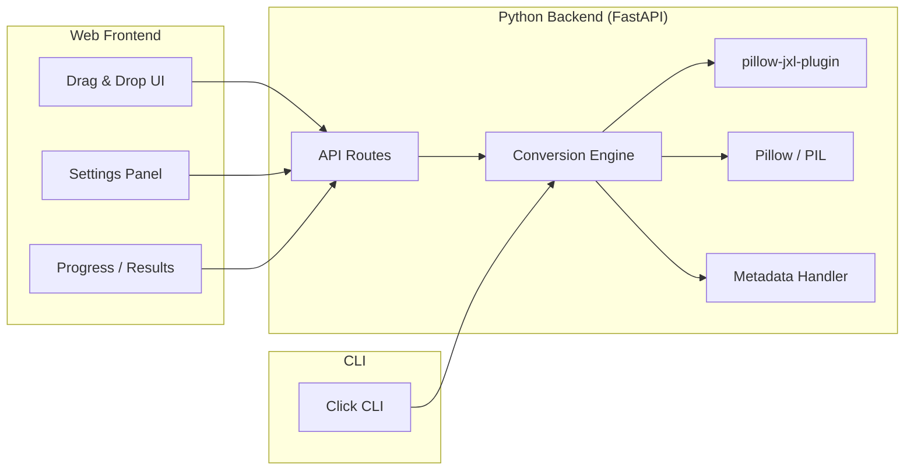

# JXL Tools — JPEG XL Conversion Suite

A Python-based JPEG XL conversion tool with a premium web UI and a CLI, supporting single/batch conversion, quality tuning, and metadata preservation.

## Architecture Overview



**Single Python package** managed with `uv`. FastAPI serves both the API and the static web UI. No separate frontend build step — vanilla HTML/CSS/JS served directly.

## User Review Required

> [!IMPORTANT]
> **Web UI vs CLI-only**: The plan includes both a polished web UI (served by FastAPI) and a CLI. If you'd prefer CLI-only, or want a desktop GUI (e.g. Tauri/Electron) instead, let me know.

> [!IMPORTANT]
> **Scope of "batch"**: The plan supports folder-based batch conversion (recursive). Should it also support zip uploads via the web UI, or is folder-based enough for now?

## Tech Stack

| Layer | Technology | Why |
|:------|:-----------|:----|
| Runtime | Python 3.13 via `uv` | Already available, fast |
| JXL codec | `pillow-jxl-plugin` | Best-maintained Pillow JXL plugin, Rust bindings to `libjxl`, supports quality/lossless/effort/distance/EXIF |
| Image handling | `Pillow` | Industry standard, format detection, EXIF access |
| Web server | `FastAPI` + `uvicorn` | Async, fast, easy SSE for progress |
| CLI | `click` | Clean CLI framework |
| Metadata | `Pillow` EXIF + fallback to raw box copy | Preserve EXIF, ICC, XMP where possible |
| Frontend | Vanilla HTML/CSS/JS | No build step, served as static files |

## Features

### Core Conversion
- **To JXL**: PNG, JPEG, WebP, TIFF, BMP → JXL
- **From JXL**: JXL → PNG, JPEG, WebP, TIFF
- **Lossless JPEG→JXL**: Bit-exact JPEG reconstruction (when using `cjxl` path — stretch goal)

### Quality Controls
- **Mode toggle**: Lossless / Lossy
- **Quality slider**: 1–100 (maps to `quality` param)
- **Distance**: 0.0–25.0 (advanced, Butteraugli metric)
- **Effort**: 1–9 (speed vs compression tradeoff)
- Presets: "Web optimized" (q80, e4), "Archive quality" (lossless, e7), "Fast preview" (q70, e1)

### Metadata
- Preserve EXIF data by default (toggle to strip)
- Preserve ICC color profiles
- Show metadata summary in results (camera, dimensions, color space)

### Batch Processing
- Select entire folder (recursive option)
- Mirror source folder structure in output
- Progress bar with per-file status
- Summary report (total size saved, per-file stats)

### Web UI Features
- Drag-and-drop zone for files/folders
- Live preview comparison (original vs converted, side-by-side slider)
- File size before/after with savings percentage
- Dark theme, glassmorphism, smooth animations
- Download individual files or zip of batch results

### CLI Features
- `jxl-tools convert <input> [--output] [--quality] [--lossless] [--effort] [--recursive] [--strip-metadata]`
- `jxl-tools info <file>` — show JXL file details
- Progress bar via `rich`

## Proposed Changes

### Project Structure

```
d:\Projects\jxl-tools\
├── pyproject.toml              # uv project config
├── README.md
├── src/
│   └── jxl_tools/
│       ├── __init__.py
│       ├── __main__.py         # CLI entry point
│       ├── cli.py              # Click CLI commands
│       ├── converter.py        # Core conversion engine
│       ├── metadata.py         # EXIF/ICC handling
│       ├── models.py           # Pydantic models for API
│       ├── server.py           # FastAPI app + routes
│       └── static/             # Web UI files
│           ├── index.html
│           ├── style.css
│           ├── app.js
│           └── favicon.svg
├── jxl_resources.md            # (existing)
└── tests/
    └── test_converter.py
```

---

### [NEW] pyproject.toml
Project configuration with `uv`. Dependencies: `pillow`, `pillow-jxl-plugin`, `fastapi`, `uvicorn`, `click`, `rich`, `python-multipart`. Script entry points for both CLI and server.

---

### [NEW] src/jxl_tools/converter.py
Core conversion engine:
- `convert_to_jxl(input_path, output_path, quality, lossless, effort, distance, preserve_metadata)` 
- `convert_from_jxl(input_path, output_path, format, quality, preserve_metadata)`
- `convert_batch(input_dir, output_dir, recursive, **kwargs)` — yields progress events
- `get_image_info(path)` — returns dimensions, format, size, metadata summary
- Format detection, validation, error handling

---

### [NEW] src/jxl_tools/metadata.py
Metadata extraction and preservation:
- `extract_metadata(image)` — returns EXIF dict, ICC profile, XMP if available
- `apply_metadata(image, metadata)` — re-applies metadata to output
- `format_metadata_summary(metadata)` — human-readable summary

---

### [NEW] src/jxl_tools/models.py
Pydantic models:
- `ConversionSettings` — quality, lossless, effort, distance, preserve_metadata, output_format
- `ConversionResult` — input/output paths, sizes, savings %, duration, metadata summary
- `BatchProgress` — current file, completed count, total count, results so far

---

### [NEW] src/jxl_tools/server.py
FastAPI application:
- `POST /api/convert` — single file conversion (multipart upload)
- `POST /api/convert-batch` — multiple files (multipart upload)
- `GET /api/convert-batch/{job_id}/progress` — SSE endpoint for batch progress
- `GET /api/preview/{filename}` — serve converted file for preview
- `GET /api/download/{filename}` — download converted file
- `POST /api/download-batch/{job_id}` — download zip of batch results
- `POST /api/info` — get image info/metadata
- Static file serving for the web UI at `/`

---

### [NEW] src/jxl_tools/cli.py
Click CLI:
- `jxl-tools convert` — convert single file or folder
- `jxl-tools info` — display file information
- `jxl-tools serve` — start web UI server
- Rich progress bars and formatted output

---

### [NEW] src/jxl_tools/static/index.html + style.css + app.js
Premium web UI:
- **Design**: Dark theme with deep navy/purple palette, glassmorphism panels, smooth transitions
- **Upload zone**: Large drag-and-drop area with animated border, file type icons
- **Settings panel**: Mode toggle (lossless/lossy), quality slider with real-time label, effort selector, preset buttons, metadata toggle
- **Results view**: Side-by-side image comparison with a slider divider, file size bars with savings %, metadata panel
- **Batch view**: File list with individual progress indicators, summary stats card
- **Typography**: Inter font from Google Fonts

## Open Questions

> [!IMPORTANT]
> 1. **Do you want the web UI + CLI combo, or just one of them?**
> 2. **Any preference on the port** for the web server? (I'll default to `8787`)
> 3. **Should batch mode support zip upload** in the web UI, or just multi-file selection?
> 4. **cjxl/djxl fallback**: Should we also support shelling out to `cjxl`/`djxl` for advanced features (like bit-exact JPEG reconstruction), or keep it pure-Python with `pillow-jxl-plugin` only?

## Verification Plan

### Automated Tests
- Unit tests for `converter.py` — test lossless roundtrip, lossy quality, metadata preservation, format detection
- Test with sample images (generate small test PNGs/JPEGs programmatically)
- `uv run pytest tests/`

### Manual Verification
- Start server with `uv run jxl-tools serve`, open in browser
- Test drag-and-drop with various image formats
- Verify quality slider produces visually different outputs
- Verify EXIF data is preserved (check with image viewer)
- Test batch conversion with a folder of mixed images
- Test CLI: `uv run jxl-tools convert sample.png --quality 85`
